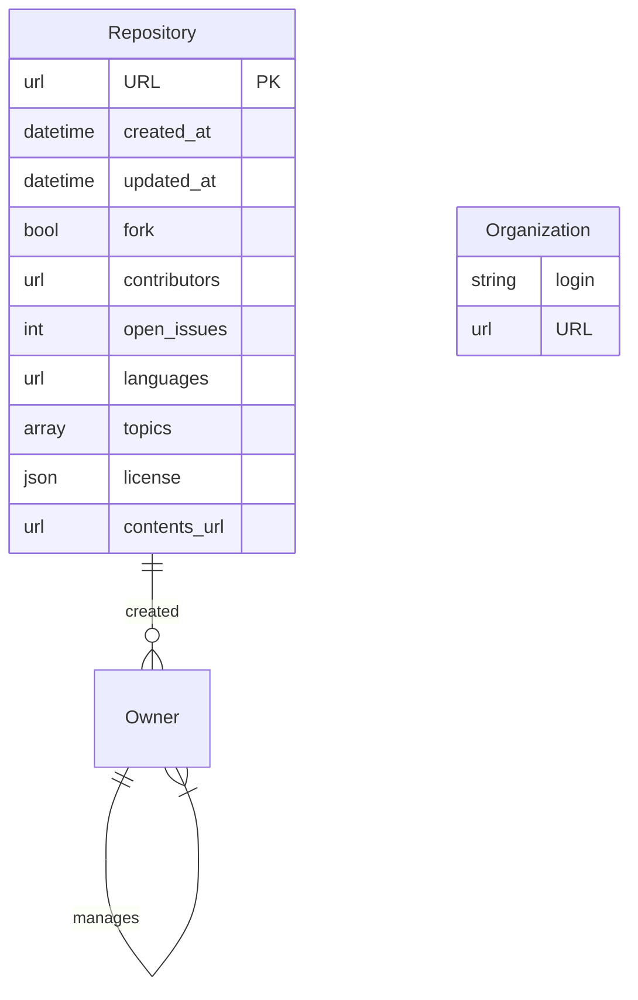
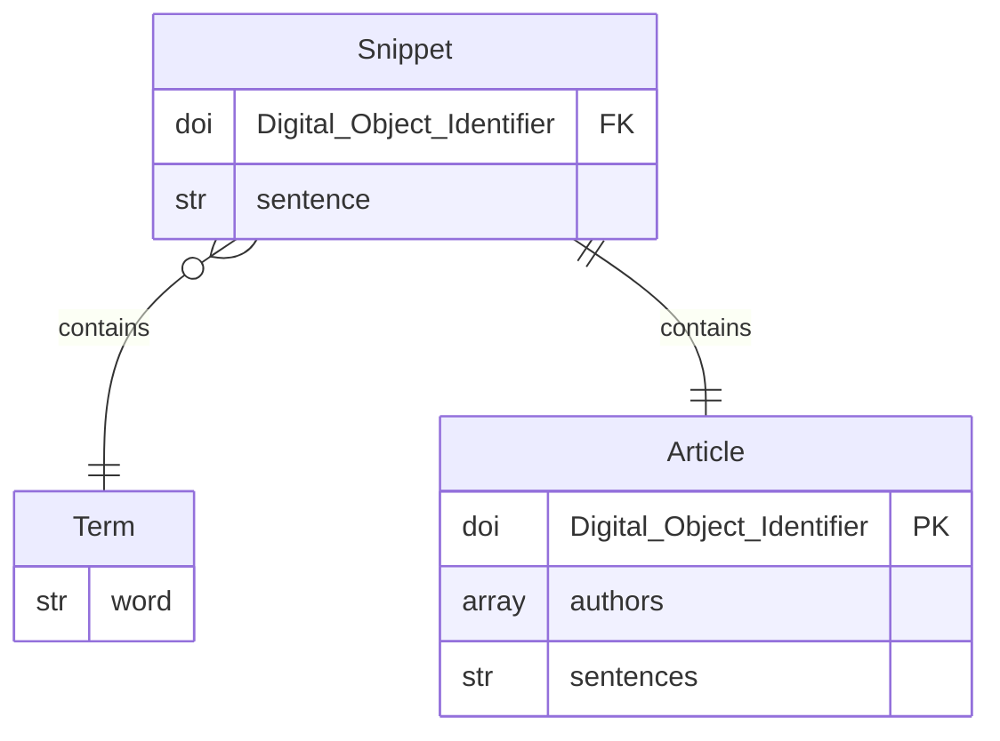
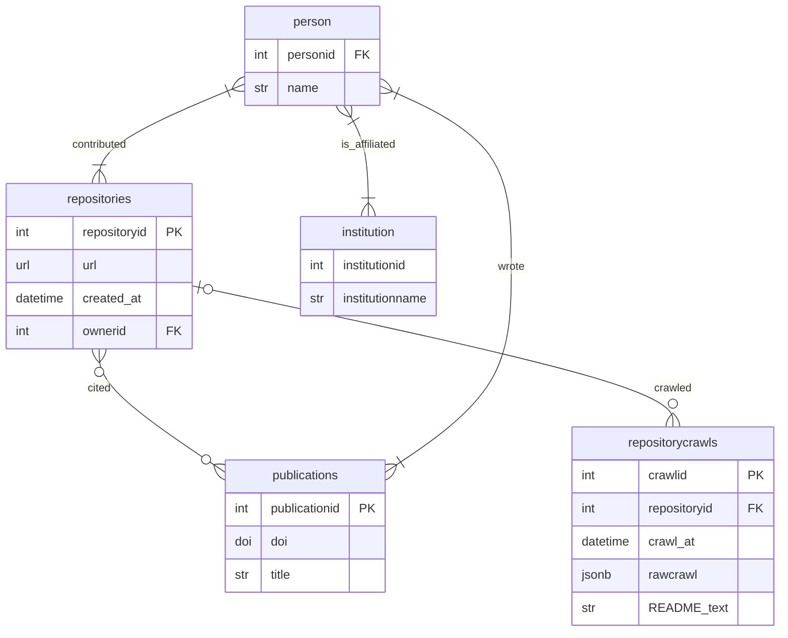

## How do we store the data?

We talked in our [previous post](introduction.md) about some of the things we want to store in our database. We want to know about open source code. For that we can start to look at a few public resources:

* [GitHub](#GitHub) is a widely used open software version control platform. Is suported by a [Python library](https://pygithub.readthedocs.io/en/stable/)
* [GitLab](#GitLab) is a widely used open software version control platform. Is supported by a [Python library](https://pypi.org/project/python-gitlab/)
* [OSF.io](#osfio) is an open source framework for research that includes software resources.
* [xDeepDive](#xdeepdive) is a tool for full-text searching of published articles.
* [OpenAlex](#openalex) is a searchable knowledge graph that allows us to connect article DOIs to individuals and institutions.
* [CrossRef](#crossref) is the central data management resource for publisher's DOIs. Providing article metadata.
* [DataCite](#datacite) 

By the time we've modeled some of our key needs we've also identified some key sources or resources we want to use to actually access the data we're going to be using.

## Data Sources

### GitHub 

We are simplifying the GitHub API here to pull in the information that is most pertinent to this application. Using the most recent version of the [GitHub API (2022-11-28)](https://docs.github.com/en/rest/quickstart?apiVersion=2022-11-28), we can look at two key Classes, [repositories](https://docs.github.com/en/rest/repos/repos?apiVersion=2022-11-28) and [Organizations/Members](https://docs.github.com/en/rest/orgs/members?apiVersion=2022-11-28).



The distinction between an Organization and an Owner/Member is not entirely clear from any one GitHub repository URL, for example, it is not apparent whether *DandyCandy* in "DandyCandy/someProject" is an organization or an individual, however, we can clarify this in our database using appropriate join tables (as we'll see later). The key for us is leveraging the GitHub API through the `PyGithub` Python package.

With the GitHub package we can authenticate the user and search for repositories:

```python
G_AUTH = Auth.Token(auth)
gi = Github(auth=G_AUTH)
repo_object = gi.get_repo(repo_string)
```

We use scripts in our project to explicitly scrape GitHub repositories and add the appropriate metadata. You can see examples of GitHub scraping in our gddospo files, for example in the function [`update_repo_add_owner`](https://github.com/UW-Madison-DSI/OSPO_Data_Management/blob/main/xddsource/gddospo/ospo_db_tools.py#L101).

### GitLab

### OSF.io

### xDeepDive

[xDeepDive](https://xdd.wisc.edu/api) is a project based out of the University of Wisconsin's Geology Department. Through contracts with publishers the xDD team has digitized and extracted full text from publications. xDeepDive provides a number of tools through its public API to search records using DOIs, subject matter, authors, journal and, importantly in our case, by "snippets".

We use this tool to search for terms related to open source software, beginning with terms like "github", "gitlab", "osf.io" and others, where we actively try to link these to valid repositories or objects within the related open source management systems.



So we can use these snippets as objects to evaluate whether or not a particular sentence containing the word "GitHub" (for example) contains a valid link to a GitHub user, Orgnaization or repository. This requires a number of functions, including a regex parser (in the function [`repotest()`](https://github.com/UW-Madison-DSI/OSPO_Data_Management/blob/main/xddsource/gddospo/gdd_tools.py#L3`)), and some other associated checks. At then end, this provides us with a link between GitHub repositories and article DOIs which can be further resolved with [CrossRef](#crossref).

### CrossRef

### OpenAlex

## OSPO Data Model

Once we have defined the APIs we will be pulling from, and clarified (for ourselves) the kinds of data we wish to display, we can build a data model for the database itself. The database must manage repository owners (organizations and users) and link these to people. These people may also be journal article authors. People may (or may not) have institutional affiliations, and may have multiple affiliations.

Repositories have contents that may change over time. They may be referenced by journal articles, or other resources on the web.

From this simplistic overview, we can continue with our modeling to build a reasonable ER Diagram:



The model itself is fully described in the [OSPO_Data_Management GitHub Repository](https://github.com/UW-Madison-DSI/OSPO_Data_Management/tree/main).

The data structure allows us to investigate elements of repositories that may be of significance, either for helping to support OS development within an institution or helping to improve the reach or impact of research that relies heavily on open source software [@bhattarai2022open;@farber2020analyzing].

* Properties of repositories owned by people at an institution (the University of Wisconsin)
* Compare repositories developed by several people against repositories with only a single contributor
* Properties of repositories that are cited in publications

Once the data structure is clearly defined, we can begin to populate the database.